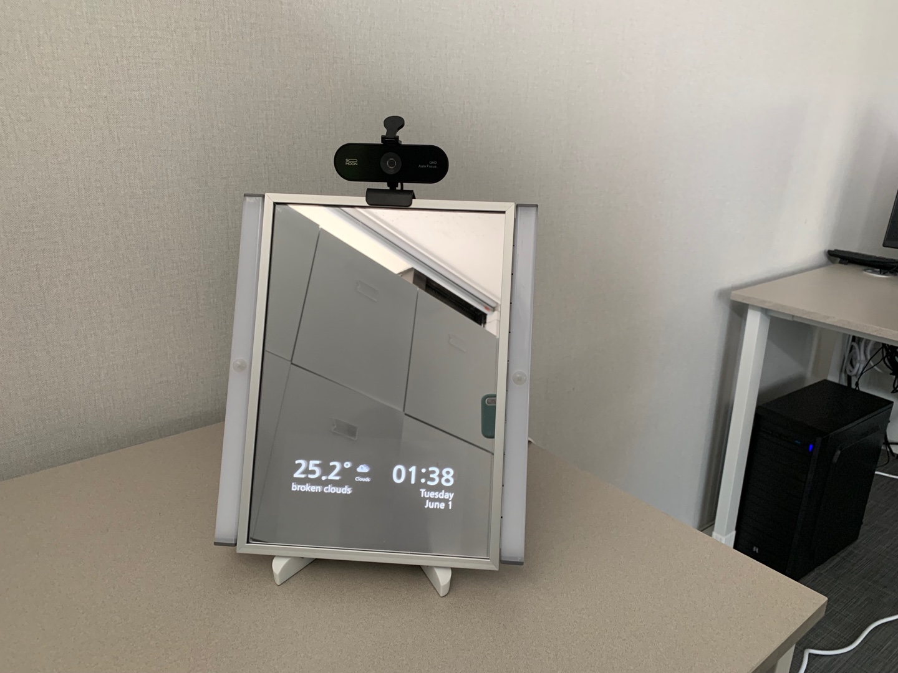
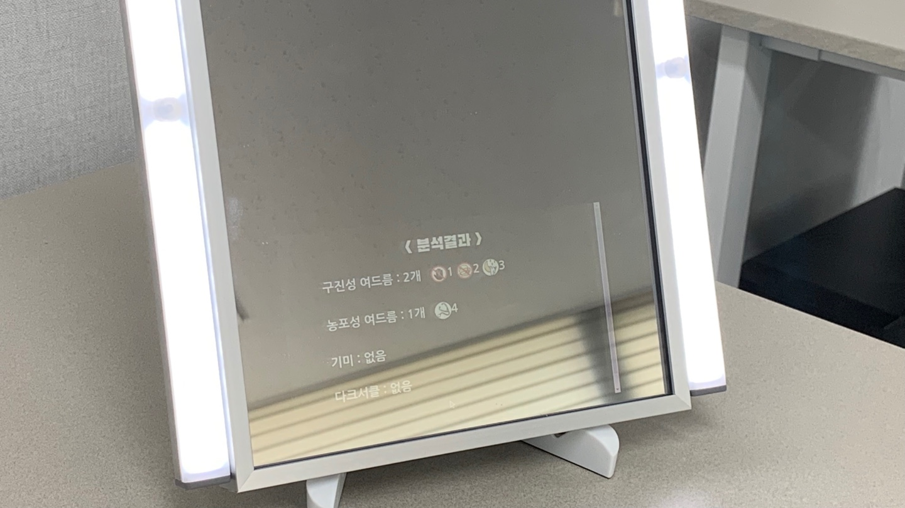
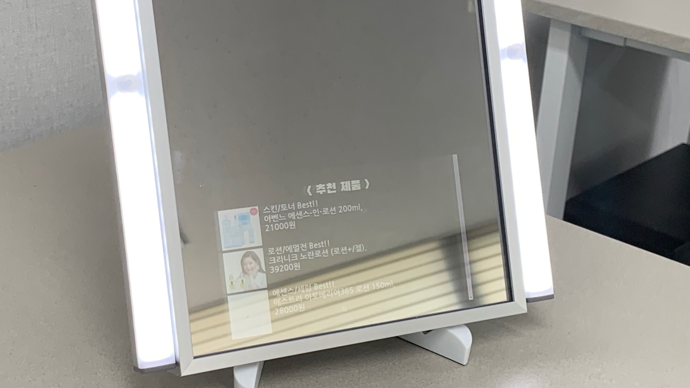

# Smart Mirror Project with Raspberry Pi

												         

**python**

**cv2**

**haarcascade** for face recognition

**tensorflow** for wake word 

**kakao api** for command recognition

**selenium** for web control

## How it works

run main.py

## Features

1. Voice commands to control user interface

   1) '오늘 어때': run the camera to take pictures of face

   2) '수고했어' : go back to the home page (MirrorUI)

2. Take pictures continually until the picture has any face (using haarcascade)

## References

** opencv 와 오디오 충돌
[ WARN:0] global /tmp/pip-wheel-qd18ncao/opencv-python/opencv/modules/videoio/src/cap_v4l.cpp (1004) tryIoctl VIDEOIO(V4L2:/dev/video0): select() timeout. error

$ sudo rpi-update # to make sure the v4L2 drive is available.
$ sudo modprobe bcm2835-v4l2 # to load it and create /dev/video0

https://www.raspberrypi.org/forums/viewtopic.php?t=68247
https://wikidocs.net/83596

** opencv 얼굴 가이드 라인 합성
https://stackoverflow.com/questions/60290354/opencv-augmenting-video-stream-source-png-not-rendering-transparency-as-expect

** V4L2 Test Bench 설치
sudo apt-get install -y qv4l2
https://www.raspberrypi.org/forums/viewtopic.php?t=193384

** opencv에서 mjpg format 사용하기
https://stackoverflow.com/questions/39155923/how-to-set-webcam-codec-in-opencv-3-1-0

** 라즈베리파이 해상도 커스텀 모드
hdmi_cvt=800 480 60 6
hdmi_group=2
hdmi_mode=87
hdmi_drive=2
https://wikidocs.net/7826

v4l2-ctl --device=/dev/video0 -L
                     brightness 0x00980900 (int)    : min=-64 max=64 step=1 default=0 value=0
                       contrast 0x00980901 (int)    : min=0 max=95 step=1 default=1 value=1
                     saturation 0x00980902 (int)    : min=0 max=100 step=1 default=34 value=54
                            hue 0x00980903 (int)    : min=-2000 max=2000 step=1 default=0 value=0
 white_balance_temperature_auto 0x0098090c (bool)   : default=1 value=1
                          gamma 0x00980910 (int)    : min=100 max=300 step=1 default=100 value=100
           power_line_frequency 0x00980918 (menu)   : min=0 max=2 default=1 value=2
				0: Disabled
				1: 50 Hz
				2: 60 Hz
      white_balance_temperature 0x0098091a (int)    : min=2800 max=6500 step=1 default=4600 value=3500 flags=inactive
                      sharpness 0x0098091b (int)    : min=1 max=7 step=1 default=1 value=7
         backlight_compensation 0x0098091c (int)    : min=0 max=1 step=1 default=0 value=0
                  exposure_auto 0x009a0901 (menu)   : min=0 max=3 default=3 value=1
				1: Manual Mode
				3: Aperture Priority Mode
              exposure_absolute 0x009a0902 (int)    : min=3 max=2047 step=1 default=166 value=166
                 focus_absolute 0x009a090a (int)    : min=0 max=1023 step=1 default=0 value=160 flags=inactive
                     focus_auto 0x009a090c (bool)   : default=0 value=1

